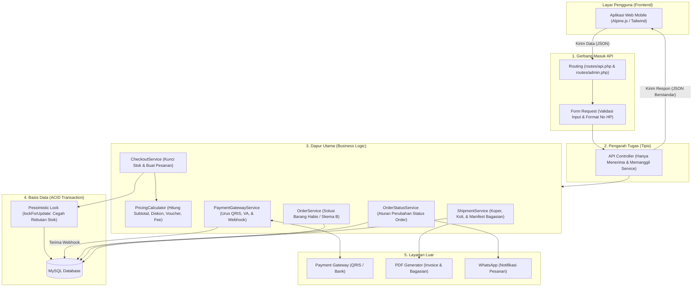
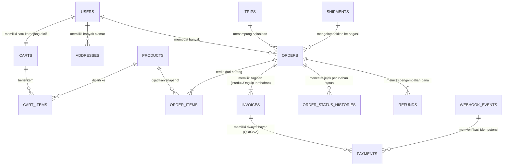
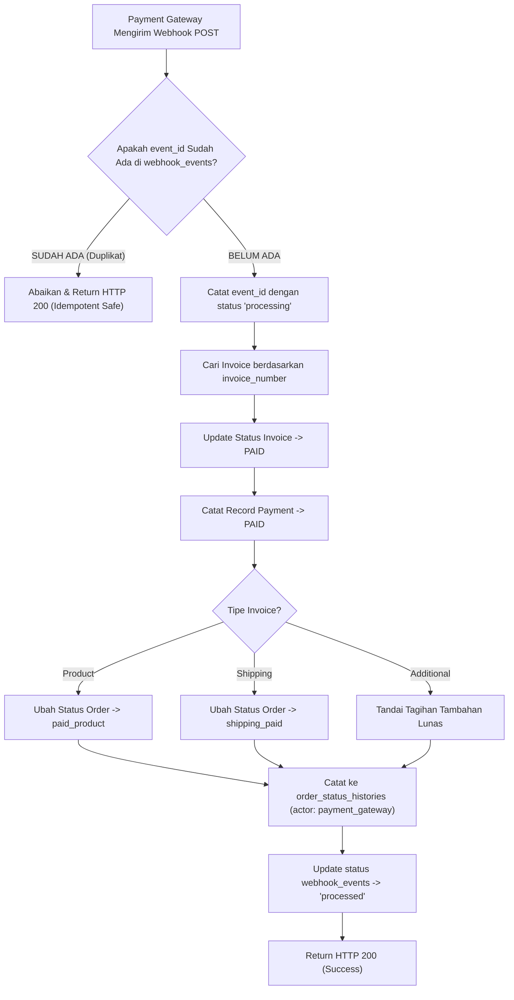

# 📊 Diagram Arsitektur & Alur Bisnis Galaksian

> Dokumen ini memuat diagram visual lengkap arsitektur backend Galaksian menggunakan format **Mermaid**. GitHub dan Markdown viewer modern mendukung rendering langsung diagram ini.

---

## 📌 Daftar Diagram
1. [Arsitektur Aliran Kerja Backend (Request Lifecycle)](#1-arsitektur-aliran-kerja-backend-request-lifecycle)
2. [Alur Transaksi Jastip 2 Tahap (Inovasi Inti)](#2-alur-transaksi-jastip-2-tahap-inovasi-inti)
3. [Siklus Hidup Status Pesanan (Order State Machine)](#3-siklus-hidup-status-pesanan-order-state-machine)
4. [Peta Hubungan Data di Database (ERD Sederhana)](#4-peta-hubungan-data-di-database-erd-sederhana)
5. [Alur Webhook Pembayaran Idempotent (Anti Bayar Dobel)](#5-alur-webhook-pembayaran-idempotent-anti-bayar-dobel)

---

## 1. Arsitektur Aliran Kerja Backend (Request Lifecycle)

Diagram ini memperlihatkan bagaimana permintaan (*request*) dari layar HP pengguna diproses langkah demi langkah oleh backend hingga masuk ke database:

---

## 2. Alur Transaksi Jastip 2 Tahap (Inovasi Inti)

Diagram ini menjelaskan mengapa ada dua tahap penagihan (Invoice Produk di awal, lalu Invoice Ongkir setelah barang ditimbang di Indonesia):

---

## 3. Siklus Hidup Status Pesanan (Order State Machine)

Diagram ini menunjukkan transisi status pesanan yang dikontrol secara ketat oleh `OrderStatusService.php`. Status tidak boleh melompat secara ilegal:

---

## 4. Peta Hubungan Data di Database (ERD Sederhana)

Diagram relasi entitas berikut memperlihatkan bagaimana tabel-tabel utama di basis data saling berelasi:

---

## 5. Alur Webhook Pembayaran Idempotent (Anti Bayar Dobel)

Diagram alur penanganan notifikasi pembayaran dari payment gateway agar bebas dari risiko dobel transaksi:

