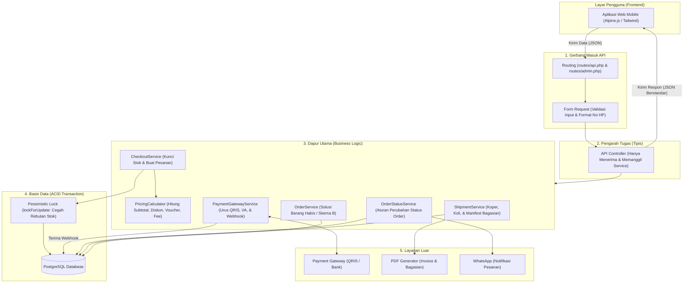
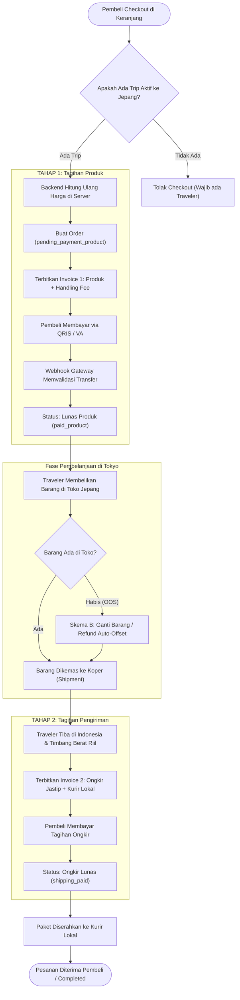
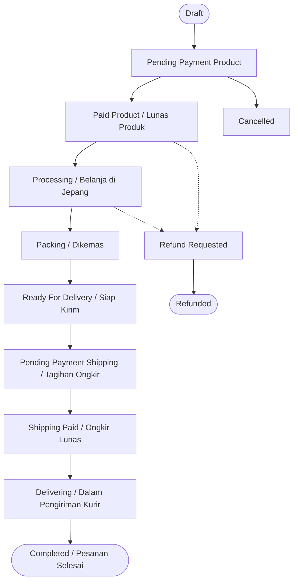
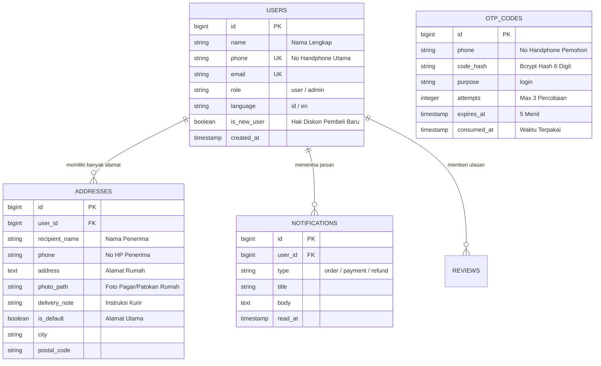
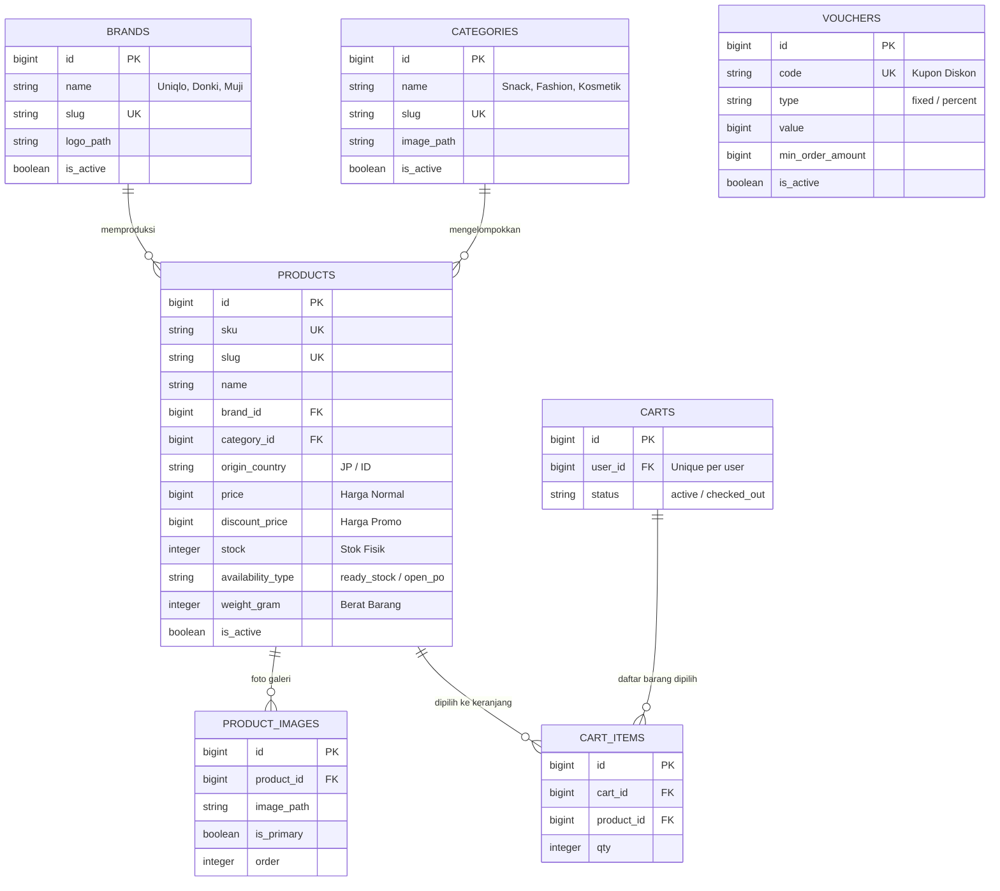
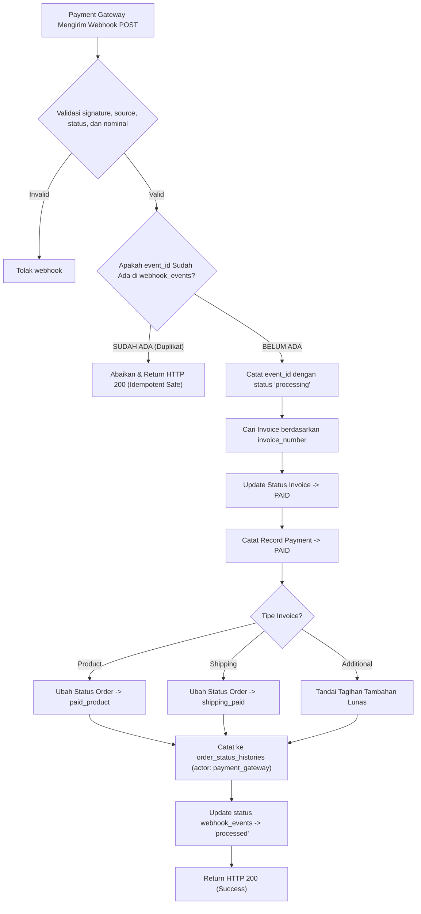

# 📊 Diagram Arsitektur & Alur Bisnis Galaksian

> Dokumen ini memuat diagram visual lengkap arsitektur backend Galaksian menggunakan format **Mermaid**. GitHub dan Markdown viewer modern mendukung rendering langsung diagram ini.

---

## 📌 Daftar Diagram
1. [Arsitektur Aliran Kerja Backend (Request Lifecycle)](#1-arsitektur-aliran-kerja-backend-request-lifecycle)
2. [Alur Transaksi Jastip 2 Tahap (Inovasi Inti)](#2-alur-transaksi-jastip-2-tahap-inovasi-inti)
3. [Siklus Hidup Status Pesanan (Order State Machine)](#3-siklus-hidup-status-pesanan-order-state-machine)
4. [Diagram Relasi Entitas Lengkap (Complete Database ERD)](#4-diagram-relasi-entitas-lengkap-complete-database-erd)
   - [4.1 Master ERD: Seluruh Entitas & Kolom Lengkap](#41-master-erd-seluruh-entitas--kolom-lengkap)
   - [4.2 Sub-ERD: Domain Transaksi & Jastip 2 Tahap](#42-sub-erd-domain-transaksi--jastip-2-tahap)
   - [4.3 Sub-ERD: Domain Pengguna & Otentikasi](#43-sub-erd-domain-pengguna--otentikasi)
   - [4.4 Sub-ERD: Domain Katalog & Keranjang](#44-sub-erd-domain-katalog--keranjang)
5. [Alur Webhook Pembayaran Idempotent (Anti Bayar Dobel)](#5-alur-webhook-pembayaran-idempotent-anti-bayar-dobel)

---

## 1. Arsitektur Aliran Kerja Backend (Request Lifecycle)

Diagram ini memperlihatkan bagaimana permintaan (*request*) dari layar HP pengguna diproses langkah demi langkah oleh backend hingga masuk ke database:

---

## 2. Alur Transaksi Jastip 2 Tahap (Inovasi Inti)

Diagram ini menjelaskan mengapa ada dua tahap penagihan (Invoice Produk di awal, lalu Invoice Ongkir setelah barang ditimbang di Indonesia):

---

## 3. Siklus Hidup Status Pesanan (Order State Machine)

Diagram ini menunjukkan transisi status pesanan yang dikontrol secara ketat oleh `OrderStatusService.php`. Status tidak boleh melompat secara ilegal:

---

## 4. Diagram Relasi Entitas Lengkap (Complete Database ERD)

### 4.1 Master ERD: Seluruh Entitas & Kolom Lengkap

Diagram ini memuat **seluruh 22 tabel basis data Galaksian** lengkap dengan tipe data, Primary Key (`PK`), Foreign Key (`FK`), Unique Key (`UK`), serta kardinalitas relasi yang presisi:

```mermaid
erDiagram
    %% ========================================================
    %% 1. PENGGUNA, OTENTIKASI & PROFIL
    %% ========================================================
    users {
        bigint id PK
        string name "Nama Lengkap"
        string phone UK "Nomor Handphone E.164"
        string email UK "Email (Opsional)"
        string password "Hashed Password"
        string role "user / admin"
        string language "id / en"
        boolean is_new_user "Penanda Pengguna Baru"
        timestamp new_user_promo_used_at "Waktu Promo Pertama Digunakan"
        timestamp last_login_at "Waktu Login Terakhir"
        timestamp created_at
        timestamp deleted_at "Soft Delete"
    }

    otp_codes {
        bigint id PK
        string phone "Nomor Handphone Tujuan"
        string code_hash "Bcrypt Hash 6 Digit OTP"
        string purpose "login / verify"
        timestamp expires_at "Kedaluwarsa (5 Menit)"
        integer attempts "Jumlah Percobaan (Max 3)"
        timestamp consumed_at "Waktu OTP Dipakai"
        string ip_address "Alamat IP Klien"
        timestamp created_at
    }

    addresses {
        bigint id PK
        bigint user_id FK "Relasi ke users"
        string label "Rumah, Kantor, dll"
        string recipient_name "Nama Penerima"
        string phone "No Handphone Penerima"
        text address "Alamat Lengkap"
        string photo_path "Foto Patokan / Pagar Rumah"
        string api_address "Alamat Terstandar API"
        string delivery_note "Instruksi Kurir"
        boolean is_default "Alamat Default Pengiriman"
        string country "ID / JP"
        string province "Provinsi"
        string city "Kota / Kabupaten"
        string district "Kecamatan"
        string postal_code "Kode Pos"
        timestamp created_at
    }

    notifications {
        bigint id PK
        bigint user_id FK "Relasi ke users"
        string type "order / payment / refund / promo"
        string title "Judul Notifikasi"
        text body "Pesan Lengkap"
        json data "Metadata Tambahan"
        timestamp read_at "Waktu Dibaca"
        timestamp created_at
    }

    %% ========================================================
    %% 2. KATALOG PRODUK, BRAND, KATEGORI & KERANJANG
    %% ========================================================
    brands {
        bigint id PK
        string name "Nama Brand (Uniqlo, Donki, dll)"
        string slug UK "URL Slug Brand"
        string logo_path "Path Gambar Logo"
        boolean is_active "Status Tampil"
        timestamp created_at
    }

    categories {
        bigint id PK
        string name "Nama Kategori"
        string slug UK "URL Slug Kategori"
        string image_path "Path Gambar Kategori"
        boolean is_active "Status Tampil"
        timestamp created_at
    }

    products {
        bigint id PK
        string sku UK "Kode Unik SKU"
        string slug UK "URL Slug Produk"
        string name "Nama Produk Jastip"
        text description "Deskripsi Detail"
        bigint brand_id FK "Relasi ke brands"
        bigint category_id FK "Relasi ke categories"
        string origin_country "JP / ID"
        string currency "IDR / JPY"
        bigint price "Harga Asli (Integer Rupiah)"
        bigint discount_price "Harga Diskon (Opsional)"
        integer stock "Stok Barang Fisik"
        integer low_stock_threshold "Batas Warning Stok"
        string availability_type "ready_stock / open_po"
        boolean is_active "Status Aktif Produk"
        boolean is_flash_sale "Status Flash Sale"
        timestamp flash_sale_start_at
        timestamp flash_sale_end_at
        integer weight_gram "Berat Estimasi dalam Gram"
        timestamp created_at
        timestamp deleted_at "Soft Delete"
    }

    product_images {
        bigint id PK
        bigint product_id FK "Relasi ke products"
        string image_path "Path Berkas Foto"
        boolean is_primary "Foto Utama Display"
        integer order "Urutan Tampil Galeri"
        timestamp created_at
    }

    carts {
        bigint id PK
        bigint user_id FK "Relasi ke users (Unique)"
        string status "active / checked_out / abandoned"
        timestamp created_at
    }

    cart_items {
        bigint id PK
        bigint cart_id FK "Relasi ke carts"
        bigint product_id FK "Relasi ke products"
        integer qty "Jumlah Item"
        timestamp created_at
    }

    vouchers {
        bigint id PK
        string code UK "Kode Kupon Diskon"
        string type "fixed / percent"
        bigint value "Nominal Diskon (Rp / %)"
        bigint max_discount "Maks Diskon (Jika %)"
        bigint min_order_amount "Min Belanja"
        integer usage_limit "Batas Total Kuota"
        integer usage_per_user "Batas Kuota Per User"
        string applicable_scope "product / shipping / all"
        timestamp starts_at "Mulai Berlaku"
        timestamp ends_at "Batas Berlaku"
        boolean is_active "Status Aktif Voucher"
        timestamp created_at
    }

    banners {
        bigint id PK
        string title "Judul Banner"
        string image_path "Path Gambar Banner"
        string link_url "Tautan Promosi"
        string cta_text "Teks Tombol Aksi"
        integer order "Urutan Display"
        boolean is_active "Status Tampil"
        string locale "id / en"
        string country_filter "all / JP / ID"
        timestamp created_at
    }

    %% ========================================================
    %% 3. OPERASIONAL JASTIP (TRIP & BAGASIAN SHIPMENT)
    %% ========================================================
    trips {
        bigint id PK
        string code UK "Kode Trip (TRIP-2026-09-JP)"
        string origin_country "ID (Indonesia)"
        string destination_country "JP (Jepang)"
        timestamp departure_at "Jadwal Keberangkatan"
        timestamp arrival_at "Jadwal Kepulangan"
        timestamp cutoff_at "Batas Waktu Order"
        string status "draft / active / ongoing / completed"
        text notes "Catatan Rute Belanja"
        timestamp created_at
    }

    shipments {
        bigint id PK
        string shipment_number UK "Nomor Koli / Bagasi"
        bigint trip_id FK "Relasi ke trips"
        string status "draft / in_transit / arrived / delivered"
        string origin_country "JP"
        string destination_country "ID"
        string bagasian_reference "Ref Bea Cukai / AWB"
        string packing_estimate_weight "Estimasi Berat Koli (kg)"
        string packing_estimate_volume "Dimensi Koper / Koli"
        bigint packing_estimate_cost "Biaya Bagasi Pesawat"
        timestamp sent_to_bagasian_at "Waktu Dispatch Bagasi"
        string bagasian_pdf_path "Path PDF Manifest Bea Cukai"
        text wa_message "Log Pesan WA Broadcast"
        text notes "Catatan Khusus Koper"
        timestamp created_at
    }

    %% ========================================================
    %% 4. TRANSAKSI, INVOICE, PEMBAYARAN & AUDIT
    %% ========================================================
    orders {
        bigint id PK
        string order_number UK "Nomor Order (ORD-202609-XXXX)"
        bigint user_id FK "Relasi ke users"
        bigint trip_id FK "Relasi ke trips"
        bigint shipment_id FK "Relasi ke shipments"
        bigint voucher_id FK "Relasi ke vouchers (Opsional)"
        string status "pending_payment_product / paid_product / etc"
        string currency "IDR"
        bigint exchange_rate "Kurs Mata Uang"
        json address_snapshot "Salinan Alamat Saat Checkout"
        bigint product_subtotal "Subtotal Produk Asli"
        bigint product_discount_amount "Total Diskon Promo"
        bigint new_user_discount_amount "Diskon Pembeli Baru"
        bigint voucher_amount "Nominal Diskon Voucher"
        bigint handling_fee_amount "Biaya Penanganan Sistem"
        bigint product_total "Tagihan Tahap 1 (Produk)"
        bigint shipping_jastip_amount "Ongkir Bagasi JP->ID"
        bigint shipping_local_amount "Ongkir Kurir Lokal ID->ID"
        bigint shipping_total "Tagihan Tahap 2 (Pengiriman)"
        bigint grand_total "Total Transaksi Keseluruhan"
        text notes "Catatan Tambahan Pembeli"
        timestamp product_paid_at "Waktu Lunas Produk"
        timestamp shipping_paid_at "Waktu Lunas Ongkir"
        timestamp completed_at "Waktu Selesai"
        timestamp cancelled_at "Waktu Batal"
        string cancel_reason "Alasan Pembatalan"
        timestamp created_at
        timestamp deleted_at "Soft Delete"
    }

    order_items {
        bigint id PK
        bigint order_id FK "Relasi ke orders"
        bigint product_id FK "Relasi ke products"
        string product_name_snapshot "Nama Produk Saat Dibeli"
        string brand_name_snapshot "Nama Brand Saat Dibeli"
        string sku_snapshot "Kode SKU Saat Dibeli"
        integer qty "Jumlah Kuantitas"
        bigint unit_price "Harga Satuan Setelah Promo"
        bigint original_price "Harga Satuan Asli Master"
        bigint discount_amount "Potongan Diskon Satuan"
        bigint subtotal "Subtotal (unit_price x qty)"
        string availability_type "ready_stock / open_po"
        string refund_status "none / requested / refunded"
        bigint refund_amount "Nominal Refund (Jika OOS)"
        timestamp created_at
    }

    invoices {
        bigint id PK
        string invoice_number UK "Nomor Invoice (INV-202609-XXXX)"
        bigint order_id FK "Relasi ke orders"
        string type "product / shipping / additional"
        string status "pending / paid / expired / failed / refunded"
        bigint amount "Nominal Tagihan (Integer Rupiah)"
        text description "Uraian Rincian Tagihan"
        string payment_method "qris / virtual_account / paypal"
        string payment_gateway "midtrans / xendit / manual"
        string gateway_reference "ID Transaksi Gateway"
        timestamp paid_at "Waktu Terkonfirmasi Lunas"
        timestamp expired_at "Batas Waktu Bayar"
        bigint created_by "Admin ID / System"
        json payload "Data Gateway Terkait"
        timestamp created_at
    }

    payments {
        bigint id PK
        bigint invoice_id FK "Relasi ke invoices"
        string method "qris / bca_va / mandiri_va / paypal"
        string status "pending / paid / failed / expired / refund"
        bigint amount "Nominal Uang Masuk"
        string gateway_reference "Referensi Transaksi Bank"
        json raw_payload "Log Respon Gateway Mentah"
        timestamp paid_at "Waktu Dana Diterima"
        timestamp failed_at
        timestamp refunded_at
        timestamp created_at
    }

    refunds {
        bigint id PK
        bigint order_id FK "Relasi ke orders"
        bigint invoice_id FK "Relasi ke invoices (Opsional)"
        text reason "Alasan Refund (Barang Habis / OOS)"
        bigint amount "Nominal Pengembalian Dana"
        string status "pending / approved / rejected / completed"
        bigint approved_by "Admin ID yang Menyetujui"
        string refund_method "bank_transfer / auto_offset"
        string evidence_path "Bukti Transfer Refund"
        timestamp created_at
    }

    order_status_histories {
        bigint id PK
        bigint order_id FK "Relasi ke orders"
        string from_status "Status Asal"
        string to_status "Status Tujuan"
        text note "Keterangan Perubahan Status"
        string actor_type "user / admin / system"
        bigint actor_id "ID Pengubah Status"
        timestamp created_at
    }

    reviews {
        bigint id PK
        bigint user_id FK "Relasi ke users"
        bigint product_id FK "Relasi ke products"
        bigint order_id FK "Relasi ke orders"
        tinyint rating "Bintang 1-5"
        text comment "Ulasan Pembeli"
        json images "Foto Review Produk"
        string status "published / hidden"
        timestamp created_at
    }

    webhook_events {
        bigint id PK
        string source "midtrans / xendit / paypal"
        string event_id UK "ID Event Unik Gateway"
        string event_type "payment.captured / invoice.paid"
        json payload "Payload Mentah Webhook"
        string signature "HMAC Signature Keamanan"
        string status "received / processed / failed"
        timestamp processed_at "Waktu Selesai Diproses"
        timestamp created_at
    }

    settings {
        string key PK "Kunci Setting (handling_fee, dll)"
        text value "Nilai Pengaturan Sistem"
        timestamp created_at
    }

    %% ========================================================
    %% 5. RELASI KARDINALITAS LENGKAP
    %% ========================================================
    users ||--o{ addresses : "memiliki alamat"
    users ||--|| carts : "memiliki satu keranjang"
    users ||--o{ orders : "membuat pesanan"
    users ||--o{ reviews : "menulis ulasan"
    users ||--o{ notifications : "menerima pesan"

    carts ||--o{ cart_items : "berisi rincian item"
    products ||--o{ cart_items : "dimasukkan ke"
    
    brands ||--o{ products : "memproduksi"
    categories ||--o{ products : "mengelompokkan"
    products ||--o{ product_images : "memiliki foto galeri"
    products ||--o{ order_items : "disalin jadi snapshot"
    products ||--o{ reviews : "diulas dalam"

    trips ||--o{ shipments : "membawa koper bagasi"
    trips ||--o{ orders : "menampung titipan belanja"
    shipments ||--o{ orders : "mengelompokkan pesanan"
    vouchers ||--o{ orders : "diterapkan pada"

    orders ||--|{ order_items : "terdiri dari barang belanja"
    orders ||--|{ invoices : "menerbitkan nota tagihan"
    orders ||--o{ order_status_histories : "mencatat jejak status"
    orders ||--o{ refunds : "memiliki pengembalian dana"
    orders ||--o{ reviews : "dinilai oleh pembeli"

    invoices ||--o{ payments : "dibayar dengan bukti"
    invoices ||--o{ refunds : "dikompensasi via"
```

---

### 4.2 Sub-ERD: Domain Transaksi & Jastip 2 Tahap

Fokus khusus pada bagaimana pesanan belanja jastip diproses: pemisahan tagihan produk dan ongkir (*2-stage invoicing*), penugasan koper traveler (*shipment*), jejak audit status (*histories*), serta kompensasi pengembalian dana (*refund auto-offset*):

```mermaid
erDiagram
    TRIPS ||--o{ ORDERS : "menampung titipan"
    TRIPS ||--o{ SHIPMENTS : "membawa koper"
    SHIPMENTS ||--o{ ORDERS : "mengelompokkan paket"
    
    ORDERS ||--|{ ORDER_ITEMS : "rincian barang"
    ORDERS ||--|{ INVOICES : "tagihan 2 tahap"
    ORDERS ||--o{ ORDER_STATUS_HISTORIES : "jejak status"
    ORDERS ||--o{ REFUNDS : "pengembalian dana"

    INVOICES ||--o{ PAYMENTS : "bukti bayar"
    INVOICES ||--o{ REFUNDS : "kompensasi offset"

    ORDERS {
        bigint id PK
        string order_number UK
        bigint user_id FK
        bigint trip_id FK
        bigint shipment_id FK
        string status
        bigint product_total "Tagihan Tahap 1"
        bigint shipping_total "Tagihan Tahap 2"
        bigint grand_total
        json address_snapshot
    }

    ORDER_ITEMS {
        bigint id PK
        bigint order_id FK
        bigint product_id FK
        string product_name_snapshot
        integer qty
        bigint unit_price
        bigint subtotal
        string availability_type
        string refund_status
        bigint refund_amount
    }

    INVOICES {
        bigint id PK
        string invoice_number UK
        bigint order_id FK
        string type "product / shipping / additional"
        string status "pending / paid / expired"
        bigint amount "Nominal Rupiah"
        string payment_method
        string gateway_reference
        timestamp paid_at
    }

    PAYMENTS {
        bigint id PK
        bigint invoice_id FK
        string method "qris / va / paypal"
        string status "paid / pending / failed"
        bigint amount
        string gateway_reference
        timestamp paid_at
    }

    REFUNDS {
        bigint id PK
        bigint order_id FK
        bigint invoice_id FK "Offset Target"
        bigint amount
        string status "approved / completed"
        string refund_method "bank_transfer / auto_offset"
    }

    ORDER_STATUS_HISTORIES {
        bigint id PK
        bigint order_id FK
        string from_status
        string to_status
        text note
        string actor_type "user / admin / system"
    }
```

---

### 4.3 Sub-ERD: Domain Pengguna & Otentikasi

Fokus pada entitas akun pembeli, otentikasi login OTP WhatsApp/SMS tanpa password, buku alamat penerima dengan foto patokan, dan sistem notifikasi:

---

### 4.4 Sub-ERD: Domain Katalog & Keranjang

Fokus pada katalog produk Jepang/Indonesia, relasi brand, kategori, galeri foto, keranjang aktif pembeli, dan kupon voucher diskon:

---

## 5. Alur Webhook Pembayaran Idempotent (Anti Bayar Dobel)

Kontrol keamanan webhook saat ini:

- Production wajib mengaktifkan signature atau callback token.
- `event_id`/`id` wajib unik untuk idempotency.
- Source webhook harus dikenal.
- Status pembayaran dan nominal wajib valid serta nominal harus sama dengan invoice.
- Invoice dan event dikunci dalam transaksi.
- Event duplikat serta invoice yang sudah paid tidak diproses ulang.

Diagram alur penanganan notifikasi pembayaran dari payment gateway agar bebas dari risiko dobel transaksi:

