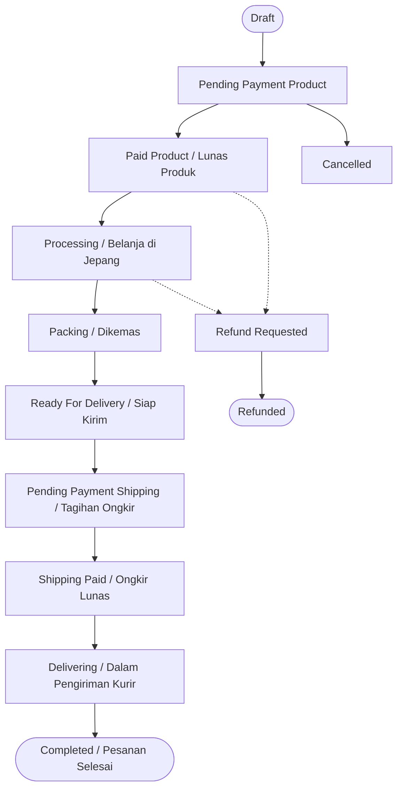

# 🚀 Panduan Lengkap Backend Galaksian (Jastip Jepang–Indonesia)

> **Dokumen Resmi Arsitektur & Alur Bisnis Backend**  
> Ditulis untuk developer, tech lead, dan AI agent agar dapat memahami seluruh sistem backend Galaksian secara cepat, jelas, dan tanpa kebingungan.  
> 📊 **Untuk versi diagram visual lengkap (Mermaid)**: Lihat [Diagram Arsitektur & Alur Mermaid](BACKEND_DIAGRAMS.md).

---

## 📌 Daftar Isi
1. [Mengenal Galaksian & Konsep Bisnis](#1-mengenal-galaksian--konsep-bisnis)
2. [Peta Cepat Kode (Di Mana Letak Kodenya?)](#2-peta-cepat-kode-di-mana-letak-kodenya)
3. [Arsitektur & Pola Desain (Clean & Decoupled)](#3-arsitektur--pola-desain-clean--decoupled)
4. [Mesin Perhitungan Harga (Pricing Engine)](#4-mesin-perhitungan-harga-pricing-engine)
5. [7 Alur Bisnis Inti (Core Business Flows)](#5-7-alur-bisnis-inti-core-business-flows)
   - [5.1 Otentikasi Pengguna (OTP Handphone)](#51-otentikasi-pengguna-otp-handphone)
   - [5.2 Katalog & Stok (Ready Stock vs Open PO)](#52-katalog--stok-ready-stock-vs-open-po)
   - [5.3 Checkout 2 Tahap (Inovasi Inti)](#53-checkout-2-tahap-inovasi-inti)
   - [5.4 Pembayaran & Webhook Idempotent (Anti Bayar Dobel)](#54-pembayaran--webhook-idempotent-anti-bayar-dobel)
   - [5.5 Siklus Status Pesanan (State Machine)](#55-siklus-status-pesanan-state-machine)
   - [5.6 Resolusi Barang Habis di Jepang (OOS Skema B)](#56-resolusi-barang-habis-di-jepang-oos-skema-b)
   - [5.7 Manifest Bagasian & Pengiriman](#57-manifest-bagasian--pengiriman)
6. [Struktur Basis Data & Aturan Finansial](#6-struktur-basis-data--aturan-finansial)
7. [Katalog Endpoint API & Format Respon](#7-katalog-endpoint-api--format-respon)
8. [Panduan Developer & Cara Uji Coba](#8-panduan-developer--cara-uji-coba)

---

## 1. Mengenal Galaksian & Konsep Bisnis

**Galaksian** bukan sekadar e-commerce biasa; Galaksian adalah platform **Jastip (Jasa Titip) Jepang–Indonesia**.  

### Mengapa Alur Jastip Berbeda dari Toko Online Biasa?
Pada e-commerce biasa, Anda membeli barang yang sudah ada di gudang lokal dan langsung membayar total beserta ongkir saat itu juga.  
Namun di Galaksian:
1. **Bergantung pada Trip Aktif**: Belanja hanya bisa dilakukan jika ada *Traveler/Trip* yang sedang aktif ke Jepang.
2. **Checkout 2 Tahap**:
   - **Tahap 1 (Checkout Awal)**: Pembeli membayar **harga produk + handling fee**. Biaya ongkir belum ditagihkan karena berat barang asli baru diketahui setelah dibeli di Jepang.
   - **Tahap 2 (Saat Barang Siap Kirim)**: Traveler kembali ke Indonesia, barang ditimbang, dan sistem/admin menerbitkan **Invoice Pengiriman (Ongkir Jastip + Kurir Lokal)**. Pembeli membayar tahap ini sebelum paket dikirim ke rumahnya.
3. **Pemberangkatan & Manifest Bagasian**: Order dari banyak pembeli dikelompokkan ke dalam koper/bagasi traveler (*Shipment Bagasian*) lengkap dengan PDF manifest untuk bea cukai bandara.

```text
+-------------------+      +---------------------+      +---------------------+
|   Tahap 1: Belanja|      |   Tahap 2: Jepang   |      |   Tahap 3: Kirim    |
|   Bayar Produk    | ---> | Pembelanjaan Produk | ---> | Bayar Ongkir &      |
|   (Invoice Produk)|      | & Penimbangan Berat |      | Pengiriman ke Rumah |
+-------------------+      +---------------------+      +---------------------+
```

---

## 2. Peta Cepat Kode (Di Mana Letak Kodenya?)

Jika Anda ingin mencari atau memodifikasi fitur tertentu, langsung tuju file-file berikut:

| Kebutuhan Anda | File / Direktori Utama | Keterangan Singkat |
|---|---|---|
| **Alur Checkout & Validasi Stok** | [`app/Services/CheckoutService.php`](file:///home/ubuntu/galaksian/app/Services/CheckoutService.php) | Validasi trip, alamat, kuota stok, buat order & invoice produk. |
| **Kalkulasi Harga & Diskon** | [`app/Services/PricingCalculator.php`](file:///home/ubuntu/galaksian/app/Services/PricingCalculator.php) | Subtotal, diskon promo, user baru, voucher, handling fee. |
| **Aturan Transisi Status Pesanan** | [`app/Services/OrderStatusService.php`](file:///home/ubuntu/galaksian/app/Services/OrderStatusService.php) | State machine legal transitions & history logging. |
| **Invoice & Tagihan Tambahan** | [`app/Services/InvoiceService.php`](file:///home/ubuntu/galaksian/app/Services/InvoiceService.php) | Generate invoice produk, invoice ongkir, invoice OOS. |
| **Pembayaran & Webhook Gateway** | [`app/Services/PaymentGatewayService.php`](file:///home/ubuntu/galaksian/app/Services/PaymentGatewayService.php) | Charge VA/QRIS/PayPal & handle webhook idempotent. |
| **Solusi Barang Habis (OOS)** | [`app/Services/OrderService.php`](file:///home/ubuntu/galaksian/app/Services/OrderService.php) | Ganti barang, offset invoice tambahan, refund. |
| **Manifest Bagasian & Koper** | [`app/Services/ShipmentService.php`](file:///home/ubuntu/galaksian/app/Services/ShipmentService.php) | Assign koli koper, tracking berat, PDF manifest. |
| **Daftar Rute API** | [`routes/api.php`](file:///home/ubuntu/galaksian/routes/api.php), [`routes/admin.php`](file:///home/ubuntu/galaksian/routes/admin.php) | Seluruh endpoint V1 untuk Pembeli, Admin, & Webhook. |

---

## 3. Arsitektur & Pola Desain (Clean & Decoupled)

Galaksian mematuhi prinsip **Clean Architecture & Separation of Concerns**:

```text
[HTTP Request]
      |
      v
[Form Request]  --> Validasi tipe data, format nomor HP, ownership alamat
      |
      v
[Controller]    --> Tipis (Thin Controller)! Tidak ada rumus harga di sini
      |
      v
[Service Layer] --> Tempat seluruh Business Logic, Kalkulasi, & Aturan Toko
      |
      v
[DB Transaction]--> ACID compliance: Pessimistic locking (lockForUpdate)
      |
      v
[API Resource]  --> Format response konsisten (tidak mengekspos model mentah)
```

### 10 Prinsip Emas Pengembangan:
1. **Controller Selalu Tipis**: Controller hanya menerima input dari Form Request, memanggil Service, lalu me-return API Resource.
2. **Harga Mutlak Dihitung Backend**: Jangan pernah mempercayai total atau diskon dari frontend.
3. **Gunakan Service Layer**: Semua aksi kompleks (checkout, status change, webhook, refund) dibungkus di dalam Service class tersendiri.
4. **Gunakan DB Transaction**: Operasi yang menyentuh stok, saldo, order, dan invoice wajib dibungkus `DB::transaction()`.
5. **Gunakan PHP Enum**: Status order, tipe invoice, metode bayar, dll. wajib menggunakan PHP 8 Backed Enum terpusat di `app/Enums/`.
6. **Uang adalah Integer (Rupiah)**: Tidak ada tipe data `float` untuk nominal uang! Semua uang disimpan sebagai `integer` atau `bigint` (Rp 150.000 = `150000`).
7. **Webhook Idempotent**: Webhook pembayaran tidak boleh memproses tagihan yang sama dua kali.
8. **Audit Trail Lengkap**: Perubahan status order dicatat ke tabel `order_status_histories`.
9. **Snapshot Data Transaksi**: Saat order dibuat, harga, nama produk, brand, dan alamat di-*snapshot* (disalin permanen) ke order item agar tidak terpengaruh jika harga master produk berubah di masa depan.
10. **Tanpa Hard Delete Transaksi**: Tabel transaksi (`orders`, `invoices`, `payments`, `refunds`) tidak boleh di-hard delete.
11. **Password Aman**: Perubahan password akun yang sudah memiliki password wajib memverifikasi password lama. Update profile tidak dapat digunakan untuk mengganti password.
12. **Harga OOS dari Database**: Penggantian barang hanya menerima `replacement_product_id`; nama dan harga dibaca dari produk aktif di database.
13. **Refund Terbatas**: Refund divalidasi terhadap sisa dana, invoice harus milik order terkait, dan approve/reject hanya boleh dari status pending.
14. **Data Sensitif Minimum**: Identity number, path file private, signature, token, dan payload sensitif tidak dikembalikan pada resource umum.

---

## 4. Mesin Perhitungan Harga (Pricing Engine)

Semua hitungan finansial diproses oleh [`PricingCalculator.php`](file:///home/ubuntu/galaksian/app/Services/PricingCalculator.php).  

### Urutan Rumus Perhitungan:
```text
1. Raw Subtotal           = Sum(Harga Asli x Qty)
2. Diskon Promo Produk    = Sum((Harga Asli - Harga Promo) x Qty)
3. Subtotal Setelah Promo = Raw Subtotal - Diskon Promo Produk
4. Diskon Pengguna Baru   = Potongan Rp / % khusus order pertama kali (User::is_new_user)
5. Diskon Voucher         = Dihitung dari sisa setelah promo & diskon user baru
6. Handling Fee           = Biaya penanganan sistem (misal: Rp 1.000)
-------------------------------------------------------------------------------------
TOTAL TAHAP 1 (PRODUK)    = Raw Subtotal - (Promo + UserBaru + Voucher) + Handling Fee

7. Ongkir Jastip (JP->ID) = Tarif per gram/kg berat bagasi
8. Ongkir Lokal (ID->ID)  = Tarif kurir lokal ke alamat rumah pembeli
-------------------------------------------------------------------------------------
TOTAL TAHAP 2 (PENGIRIMAN)= Ongkir Jastip + Ongkir Lokal
```

> **Contoh Angka Riil:**
> - Beli 2 snack @ Rp 50.000 (Harga Asli: Rp 60.000)
> - `Raw Subtotal`: Rp 120.000
> - `Diskon Promo`: Rp 20.000 -> `Subtotal Setelah Promo`: Rp 100.000
> - `Diskon User Baru`: Rp 10.000 -> `Sisa Subtotal`: Rp 90.000
> - `Voucher (10%)`: Rp 9.000 -> `Sisa`: Rp 81.000
> - `Handling Fee`: Rp 1.000
> - **Total Invoice Produk yang Dibayar di Awal = Rp 82.000**

---

## 5. 7 Alur Bisnis Inti (Core Business Flows)

### 5.1 Otentikasi Pengguna (OTP Handphone)
- User memasukkan nomor WhatsApp/HP (format E.164, misal `081234567890` atau `6281234567890`).
- Backend memproduksi kode OTP 6-digit acak dengan masa kedaluwarsa 5 menit.
- OTP disimpan dalam bentuk **hash** di database (keamanan terjamin, tidak plain text).
- Maksimal 3 kali percobaan salah.
- Setelah terverifikasi, token **Laravel Sanctum** diterbitkan untuk otentikasi API selanjutnya.
- *Mode Demo*: Tersedia tombol cepat di UI yang memanggil akun demo `081234567890`.

---

### 5.2 Katalog & Stok (Ready Stock vs Open PO)
Setiap produk memiliki tipe ketersediaan ([`ProductAvailability.php`](file:///home/ubuntu/galaksian/app/Enums/ProductAvailability.php)):
1. **Ready Stock**:
   - Fisik barang sudah ada di tangan tim Galaksian.
   - Stok dikunci dan dicek secara ketat saat checkout. Jika stok kurang dari permintaan, checkout langsung ditolak.
2. **Open PO (Pre-Order)**:
   - Barang akan dibelikan di toko Jepang saat trip berlangsung.
   - Stok tidak membatasi kuota checkout secara kaku, namun tetap mematuhi kuota bagasi trip.

---

### 5.3 Checkout 2 Tahap (Inovasi Inti)

```text
[User Checkout]
       |
       v
1. Cek Trip Aktif (Wajib ada trip OPEN / ACTIVE)
2. Cek Alamat Terdaftar (Milik user yang bersangkutan)
3. Lock Baris Produk di DB (Pessimistic Lock: lockForUpdate)
4. Hitung Ulang Harga di Backend (PricingCalculator)
5. Buat Record Order (Status: pending_payment_product)
6. Snapshot Nama, Harga, Berat, & Foto Barang ke `order_items`
7. Terbitkan Invoice 1: INVOICE PRODUK (Status: pending)
8. Generate Payment Gateway Reference (QRIS / VA / PayPal)
9. Bersihkan Keranjang Belanja
```

Setelah langkah ini, pembeli menerima halaman **Instruksi Pembayaran** dengan QRIS / nomor Virtual Account.

---

### 5.4 Pembayaran & Webhook Idempotent (Anti Bayar Dobel)
Saat pembeli menyelesaikan transfer, payment gateway mengirim HTTP POST ke `/api/v1/webhooks/payment`.

Webhook wajib memiliki `event_id` atau `id`, status pembayaran, dan nominal yang sesuai dengan invoice. Di production, secret/callback token wajib dikonfigurasi. Source tidak dikenal, status kosong, format nominal invalid, signature invalid, atau nominal mismatch ditolak.

```text
[Webhook Masuk]
       |
       v
Apakah `event_id` sudah pernah diproses di tabel `webhook_events`?
       |
  +----+----+
  |         |
 (YA)      (TIDAK)
  |         |
  |         v
  |    1. Catat `webhook_events` dengan status 'processing'
  |    2. Cari Invoice berdasarkan `invoice_number`
  |    3. Update Invoice -> PAID
  |    4. Catat Payment -> PAID
  |    5. Jika ini Invoice Produk:
  |          Ubah Status Order -> paid_product
  |       Jika ini Invoice Shipping:
  |          Ubah Status Order -> shipping_paid
  |    6. Catat OrderStatusHistory (actor: payment_gateway)
  |    7. Update `webhook_events` -> 'processed'
  v         |
Return HTTP 200 (Success)
```

**Proteksi Idempotensi**: Jika payment gateway mengirim webhook 5 kali berturut-turut karena koneksi internet lambat, hanya webhook pertama yang mengubah data. 4 webhook sisanya langsung diabaikan dengan aman tanpa efek samping.

---

### 5.5 Siklus Status Pesanan (State Machine)

Status order dikontrol ketat oleh [`OrderStatusService.php`](file:///home/ubuntu/galaksian/app/Services/OrderStatusService.php). Tidak ada perubahan status ilegal yang bisa lolos!



Semua perubahan status secara otomatis membuat catatan permanen di tabel `order_status_histories` berisi:
- Status lama & status baru
- Aktor pengubah (`user`, `admin`, atau `system`)
- Catatan alasan / keterangan waktu

---

### 5.6 Resolusi Barang Habis di Jepang (OOS Skema B)

Endpoint menerima `replacement_product_id`, bukan harga atau nama bebas dari client. Produk pengganti harus aktif dan stoknya mencukupi. Order dan item dikunci dalam transaction, dan item yang sudah memiliki resolusi tidak dapat diproses ulang.

Saat traveler berbelanja di toko fisik Jepang, bisa saja satu barang ternyata kehabisan stok (*Out of Stock*).  
Galaksian menerapkan solusi otomatis yang elegan: **Skema B (Offset Invoice)**.

Ketika barang ditandai habis oleh Admin:
1. **Opsi 1 - Ganti Barang Baru**:
   - Jika barang pengganti **lebih mahal**: Sistem menerbitkan **Invoice Tambahan (Additional Invoice)** untuk selisih harganya.
   - Jika barang pengganti **lebih murah**: Selisih lebih dikembalikan ke pembeli sebagai dana refund.
2. **Opsi 2 - Refund Penuh**:
   - Nilai barang yang habis dikompensasikan.
   - Jika pesanan memiliki **Invoice Tambahan yang belum dibayar**, dana refund **secara otomatis melunasi tagihan tersebut** (*auto-offset*), sehingga pembeli tidak perlu transfer lagi!
   - Sisa saldo lebih langsung ditransfer kembali ke rekening pembeli.

---

### 5.7 Manifest Bagasian & Pengiriman

Satu koper/bagasi penerbangan (*Shipment*) menampung banyak pesanan dari berbagai pembeli.
- Admin mengelompokkan pesanan ke dalam `shipment_id`.
- Sistem mencatat berat koli koper dan kapasitas maksimum bagasi maskapai (misal: 23 kg per koper).
- Menghasilkan dokumen **PDF Manifest Bagasian** untuk kebutuhan deklarasi bea cukai bandara secara otomatis.
- Menyediakan integrasi pesan WhatsApp otomatis untuk update no resi ke pembeli.

---

## 6. Struktur Basis Data & Aturan Finansial

### Aturan Emas Data Keuangan
1. **Dilarang keras memakai `float` atau `double` untuk uang!**
   - Di Galaksian, seluruh harga disimpan sebagai `bigint` atau `integer`.
   - Menghindari bug pembulatan desimal (contoh: bug $0.1 + $0.2 \neq $0.3).
2. **Snapshot Permanen**:
   - Tabel `order_items` memiliki kolom snapshot: `product_name_snapshot`, `price_snapshot`, `weight_grams_snapshot`.

### Ringkasan Entitas Basis Data Utama

```text
 users
   |-- 1:N --> addresses (Alamat pengiriman pembeli)
   |-- 1:N --> orders (Pesanan belanja)
   |-- 1:1 --> carts (Keranjang aktif)
                 |-- 1:N --> cart_items --> products

 orders
   |-- N:1 --> trips (Trip belanja Jepang aktif)
   |-- N:1 --> shipments (Koper/bagasi kepulangan)
   |-- 1:N --> order_items (Rincian barang belanja + snapshot)
   |-- 1:N --> invoices (Tagihan: produk, shipping, additional)
   |             |-- 1:N --> payments (Riwayat bayar VA/QRIS)
   |-- 1:N --> order_status_histories (Jejak audit status)
   |-- 1:N --> refunds (Pengembalian dana)
```

---

## 7. Katalog Endpoint API & Format Respon

Semua endpoint diawali dengan awalan versi `/api/v1`.

### Format Respon Standar

#### Respon Berhasil (HTTP 200 / 201)
```json
{
  "success": true,
  "message": "Operasi berhasil dilakukan",
  "data": { ... }
}
```

#### Respon Error Validasi (HTTP 422)
```json
{
  "success": false,
  "message": "Data yang dikirimkan tidak valid",
  "errors": {
    "address_id": ["Pilih alamat pengiriman terlebih dahulu."]
  }
}
```

#### Respon Error Bisnis (HTTP 400 / 403)
```json
{
  "success": false,
  "message": "Tidak ada trip aktif untuk checkout"
}
```

---

### Endpoint Publik & Pengguna (User API)

| Rute | HTTP | Fungsi & Kegunaan |
|---|---|---|
| `/api/v1/auth/otp/request` | `POST` | Minta kode OTP WhatsApp/SMS. |
| `/api/v1/auth/otp/verify` | `POST` | Verifikasi OTP & dapatkan Bearer Token. |
| `/api/v1/home` | `GET` | Data beranda: banner, kategori, flash sale, produk rekomendasi. |
| `/api/v1/products` | `GET` | Pencarian & filter produk (negara: Jepang/Indonesia). |
| `/api/v1/products/{slug}` | `GET` | Detail produk & spesifikasi. |
| `/api/v1/cart` | `GET` | Rincian keranjang pembeli beserta kalkulasi harga realtime. |
| `/api/v1/cart/items` | `POST` | Menambah barang ke keranjang belanja. |
| `/api/v1/cart/voucher` | `POST` | Menerapkan kode kupon/voucher diskon. |
| `/api/v1/checkout` | `POST` | Menjalankan Checkout Tahap 1 (Order + Invoice Produk). |
| `/api/v1/orders` | `GET` | Daftar pesanan user (`?type=pending` atau `?type=selesai`). |
| `/api/v1/orders/{id}` | `GET` | Rincian lengkap pesanan, riwayat invoice, & timeline pengiriman. |
| `/api/v1/orders/{id}/invoices/{invoiceId}/download` | `GET` | Mengunduh file PDF resmi invoice. |
| `/api/v1/orders/{id}/items/{itemId}/resolve-oos` | `POST` | Refund atau penggantian barang. Penggantian wajib memakai `replacement_product_id`; item hanya dapat diproses sekali. |
| `/api/v1/addresses` | `GET/POST`| Mengelola daftar alamat penerima barang. |

---

### Endpoint Admin (`/api/v1/admin/...`)

Wajib menyertakan Header: `Authorization: Bearer <ADMIN_TOKEN>`.

| Rute | HTTP | Fungsi & Kegunaan |
|---|---|---|
| `/api/v1/admin/auth/login` | `POST` | Login akun administrator (`admin@galaksian.com`). |
| `/api/v1/admin/orders` | `GET` | Memantau seluruh pesanan masuk lintas pengguna. |
| `/api/v1/admin/orders/{id}/status` | `PATCH` | Mengubah status pesanan secara legal (misal: ke packing/kirim). |
| `/api/v1/admin/orders/{id}/assign-shipment`| `POST` | Memasukkan pesanan ke dalam manifest koper koli. |
| `/api/v1/admin/orders/{id}/invoices` | `POST` | Menerbitkan Invoice Tahap 2 (Ongkir) atau Invoice Tambahan. |
| `/api/v1/admin/shipments/{id}/send-bagasian`| `POST` | Menerbitkan PDF Manifest Bagasian & broadcast WA. |
| `/api/v1/admin/refunds/{id}/approve` | `POST` | Menyetujui klaim pengembalian dana pembeli. |

---

### Endpoint Webhook (`/api/v1/webhooks/...`)

| Rute | HTTP | Fungsi |
|---|---|---|
| `/api/v1/webhooks/payment` | `POST` | Notifikasi pembayaran idempotent dengan validasi signature, source, status, dan nominal. |

Contoh Payload Webhook:
```json
{
  "event_id": "evt-20260906-001",
  "invoice_number": "INV-202609-0001",
  "status": "paid"
}
```

---

## 8. Panduan Developer & Cara Uji Coba

### 1. Persiapan Lingkungan Lokal
```bash
# Salin konfigurasi environment
cp .env.example .env

# Generate application key
php artisan key:generate

# Jalankan migrasi & data dummy seeder
php artisan migrate --seed

# Buat symbolic link storage berkas privat
php artisan storage:link

# Jalankan server aplikasi
php artisan serve
```

---

### 2. Akun Demo untuk Testing

> Credential demo hanya untuk local/testing. Jangan gunakan password atau credential pada dokumentasi ini di production.

| Tipe Akun | Identifier / Email | Keterangan |
|---|---|---|
| **Pembeli Demo (User)** | `081234567890` | Tersedia tombol *Quick Login* di web UI. |
| **Administrator (Admin)**| `admin@galaksian.com` / `password` | Digunakan untuk kontrol status pesanan & shipment. |

---

### 3. Menjalankan Pengujian Otomatis (Automated Tests)
Galaksian dilengkapi dengan test suite lengkap untuk memverifikasi kalkulasi harga, checkout, idempotensi webhook, dan keamanan:

```bash
# Menjalankan seluruh test suite (30 unit & feature test)
php artisan test
```

---

### 4. Memeriksa Standar Gaya Kode (Linting)
```bash
# Format kode otomatis menggunakan Laravel Pint
./vendor/bin/pint
```

---

### 5. Checklist Cara Menambah Fitur Baru
Jika Anda hendak menambahkan fitur baru ke backend, ikuti checklist langkah ini:
1. [ ] **Analisis Kebutuhan**: Tentukan apakah memerlukan tabel/kolom baru di basis data.
2. [ ] **Database Migration & Enum**: Buat migrasi baru dan tambahkan opsi di folder `app/Enums/` bila relevan.
3. [ ] **Form Request**: Buat kelas validasi di `app/Http/Requests/`. Jangan lakukan validasi manual di controller!
4. [ ] **Service Class**: Tulis seluruh logika bisnis di `app/Services/`. Bungkus operasi penulisan data ke dalam `DB::transaction()`.
5. [ ] **Controller**: Buat method ramping di controller yang hanya memanggil Service dan me-return API Resource.
6. [ ] **Routing**: Daftarkan rute di `routes/api.php` atau `routes/admin.php` dengan middleware auth yang sesuai.
7. [ ] **Feature Test**: Tulis automated test di `tests/Feature/` untuk skenario berhasil dan skenario gagal.
8. [ ] **Uji & Rapikan**: Jalankan `php artisan test` dan `./vendor/bin/pint`.

---
*Dokumen ini dirancang dan dipelihara untuk arsitektur backend Galaksian.*
